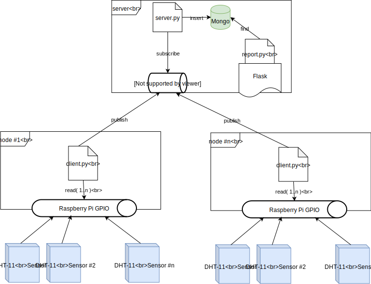
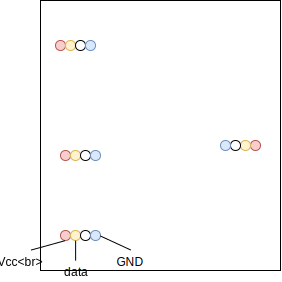

## Structure of the *system*

### Overall



### Business processes


## Database record structure
```
mongo -> db: sensors
                |
            --------
           |        |
   temperatures    humidities
        |
   { station_id }
   { timestamp  }
   { sensor_id  }
   { value      }
     
```

## Setting up the server
1. Install MQTT broker such as mosquitto
```
yum install epel-release
yum install mosquitto
systemctl enable mosquitto
mkdir /var/lib/mosquitto/
chown mosquitto:mosquitto /var/lib/mosquitto/
```
2. Install MongoDB (can be with Docker)
```
docker pull mongo
docker run -d  -p 27017:27017 mongo
```
3. Get needed Python packages
```
yum install python-pip
pip install Flask
pip install pymongo
pip install paho-mqtt
```
## Running
Running can be done with some docker image of Python or directly.
```
python server.py &
FLASK_APP=report.py flask run &
```

## Client side

1. Assuming installed raspbian on Raspberry Pi.
2. Get `paho-mqtt` for Python, also some other needed deps
```
pip install paho-mqtt setuptools wheel
```
3. Clone Adafruit_Python_DHT library (or use referenced in `client-side/`)
4. Follow instructions to compile it
 https://github.com/adafruit/Adafruit_Python_DHT/blob/master/README.md
5. Change parameters inside `client.py`
```
SERVER="my-server.host"
CLIENT_NAME="This station name"
STATION_ID=123 # This station unique ID
sensors = [15, 4, 14, 26] # GPIOs (BCM notation) to which sensors are connected
```
6. Test with `JUST_DEBUG = True` or just start
```
python client.py &
```

## Test board

